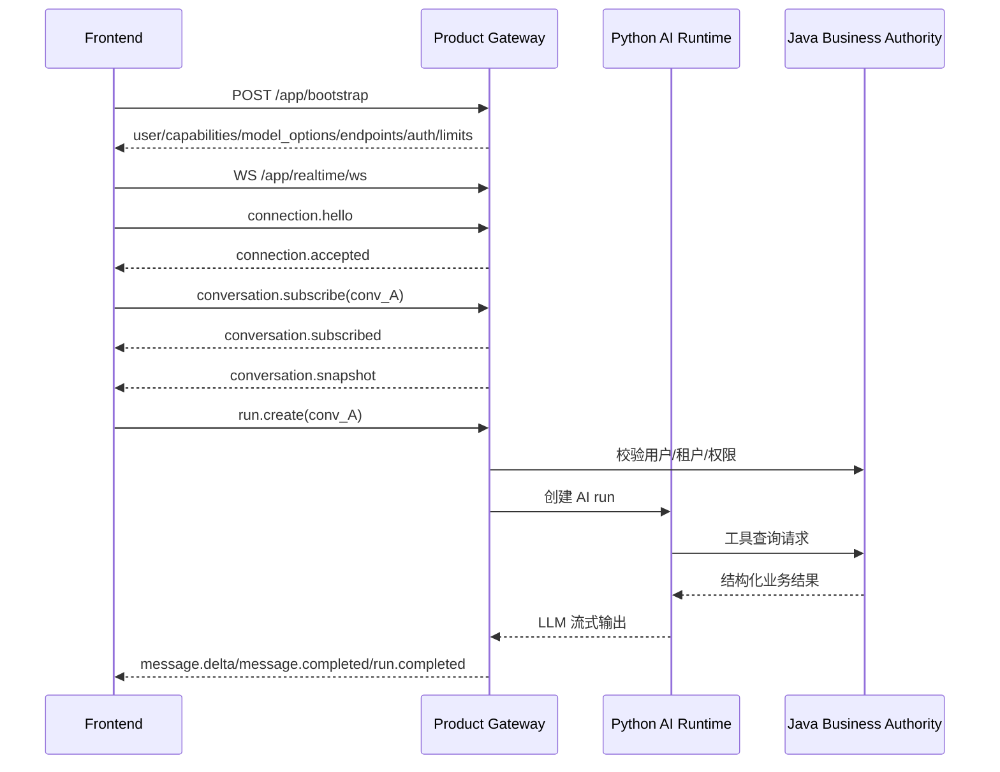

# 智慧园区助手前端实时对接契约

本文是 `docs/app-realtime-protocol.md` 的前端投影视图，用于指导 Web 前端第一阶段接入智慧园区助手实时能力。

本文不是第二套协议。完整协议仍以 `docs/app-realtime-protocol.md` 为准；本文只回答前端最关心的四个问题：

```text
前端第一阶段到底接哪些接口？
模型列表和模型选择怎么做？
每个字段前端应该怎么用？
旧接口应该怎么迁移，避免状态分裂？
```

## 1. 结论

第一阶段前端只保留一条产品实时主连接：

```text
POST /app/bootstrap
WS   /app/realtime/ws
```

其他接口不是废弃，而是辅助：

```text
GET  /app/conversations
GET  /app/conversations/{conversation_id}
POST /app/assets/upload
POST /app/operation-tickets/{ticket_id}/confirm
POST /app/operation-tickets/{ticket_id}/cancel
WS   /app/media/ws
```

辅助接口只能通过 `/app/bootstrap` 的 `endpoints` 和 `capabilities` 发现后使用，不能成为第二套实时状态通道。

其中 `WS /app/media/ws` 仅当 `media_session.created` 返回 `transport="ws"` 时才需要建立；若返回 `transport="realtime_ws"`，音频直接复用主 `/app/realtime/ws`，不建媒体连接。

前端第一阶段不要直接接：

```text
/ws/chat
/app/chat/ws
/app/voice-chat/ws
/app/avatar/ws
/v1/chat/completions
/v1/models
```

这些旧接口已经不再作为本项目入口；模型兼容接口只用于外部模型服务、调试工具或管理后台，不能进入新前端状态模型。

## 2. 第一阶段 P0 接入范围

P0 必须实现：

| 类型 | 名称 | 前端用途 |
| --- | --- | --- |
| HTTP | `POST /app/bootstrap` | 获取用户上下文、能力、endpoint、模型选项、限制、WS 建连票据 |
| WS command | `connection.hello` | 建连或重连握手 |
| WS command | `conversation.subscribe` | 订阅会话事件 |
| WS command | `conversation.unsubscribe` | 取消订阅会话 |
| WS command | `run.create` | 创建一次 AI 执行 |
| WS command | `run.cancel` | 取消指定 run |
| WS command | `operation_ticket.confirm` | 确认操作票 |
| WS command | `operation_ticket.cancel` | 取消操作票 |
| WS command | `ui.intent.result` | 回报前端工作台动作执行结果 |
| WS command | `client.ack` | 确认收到可 ack 事件 |
| WS command | `heartbeat` | 心跳 |
| WS event | `connection.accepted` | WS 握手成功 |
| WS event | `connection.rejected` | WS 握手失败 |
| WS event | `conversation.subscribed` | 会话订阅成功 |
| WS event | `conversation.snapshot` | 会话快照和恢复基线 |
| WS event | `conversation.access_revoked` | 会话权限撤销 |
| WS event | `run.created` | run 已创建 |
| WS event | `run.started` | run 开始执行 |
| WS event | `run.progress` | run 阶段进度 |
| WS event | `run.completed` | run 完成 |
| WS event | `run.failed` | run 失败 |
| WS event | `run.cancelled` | run 已取消 |
| WS event | `message.created` | 消息实体已创建 |
| WS event | `message.delta` | 助手消息流式增量 |
| WS event | `message.completed` | 消息最终内容 |
| WS event | `message.failed` | 消息失败 |
| WS event | `message.cancelled` | 消息取消 |
| WS event | `tool_call.started` | 工具查询开始 |
| WS event | `tool_call.completed` | 工具查询完成 |
| WS event | `tool_call.failed` | 工具查询失败 |
| WS event | `operation_ticket.requires_confirmation` | 需要用户确认操作票 |
| WS event | `operation_ticket.completed` | 操作票完成 |
| WS event | `operation_ticket.failed` | 操作票失败 |
| WS event | `operation_ticket.expired` | 操作票过期 |
| WS event | `operation_ticket.conflicted` | 操作票冲突 |
| WS event | `ui.intent` | AI 请求前端执行白名单工作台动作 |
| WS event | `ui.intent.acknowledged` | 服务端收到前端动作结果 |
| WS event | `ui.intent.failed` | 前端动作执行失败 |
| WS event | `error` | 通用错误 |
| WS event | `rate_limited` | 限流 |
| WS event | `permission_denied` | 权限拒绝 |
| WS event | `provider_degraded` | 模型或供应商降级 |

Phase 2 再实现：

```text
media_session.create
media_session.close
/app/media/ws
speech_started
speech_stopped
asr.partial
asr.final
tts.started
tts.segment
tts.completed
tts.cancelled
barge_in.detected
media.backpressure
avatar.state
```

除非产品明确语音是第一阶段 P0，否则不要把媒体、TTS、数字人列入第一阶段前端验收。

## 3. 模块职责

### 3.1 前端模块

| 模块 | 职责 | 不应该做的事 |
| --- | --- | --- |
| `BootstrapService` | 调 `/app/bootstrap`，保存能力、endpoint、模型选项、限制、WS 票据过期时间 | 不缓存授权结果作为后续敏感动作依据 |
| `RealtimeClient` | 管理 `/app/realtime/ws` 建连、重连、心跳、发送命令、接收事件 | 不直接连接旧 `/ws/chat`、`/app/chat/ws` |
| `SubscriptionManager` | 维护当前页面订阅的 `conversation_id` 列表和每个会话的恢复游标 | 不用全局 current conversation 决定事件归属 |
| `EventDispatcher` | 按 `type` 分发事件，做去重、排序、合并、错误处理 | 不按 `ts_ms` 或全局 `seq` 排序所有事件 |
| `MessageStreamAssembler` | 按 `conversation_id + run_id + message_id + stream_id + seq` 合并 `message.delta` | 不用数组下标或 `response_id` 识别消息 |
| `ConversationStore` | 保存会话、消息、active runs、tickets、last_event_cursor | 不保存旧协议 `session_id/thread_id/turn_id` 作为主键 |
| `ModelSelector` | 展示 `/app/bootstrap.model_options`，生成 `run.create.payload.agent` | 不暴露 `provider_id/provider_model_id/base_url` |
| `OperationTicketPanel` | 展示冻结参数、风险、过期时间，提交 `operation_ticket.confirm` | 不把 `operation_ticket_id` 或旧 `confirmation_token` 当授权凭证 |
| `UiIntentExecutor` | 执行白名单 `ui.intent`，回传 `ui.intent.result` | 不执行脚本、表达式、任意 URL 或绕过本地路由权限 |
| `LegacyProtocolGuard` | 阻止旧 `app.v1/response.*` 事件进入新 store | 不在前端做新旧协议混合状态机 |

### 3.2 后端模块

| 模块 | 职责 |
| --- | --- |
| `Product Realtime Gateway` | `/app/bootstrap`、`/app/realtime/ws`、连接身份、订阅、事件 fanout、恢复游标 |
| `Conversation Runtime` | 创建 conversation、run、message，控制同一会话 primary run 并发 |
| `Model Gateway` | 把 `model_option_id/model_profile` 解析为真实 runtime provider model |
| `Java Business Authority` | 用户、租户、权限、设备、告警、工单、操作票、审计、真实执行 |
| `Python AI Runtime` | LangGraph、RAG、LLM 编排、工具意图、自然语言总结 |
| `Tool Adapter` | 把 AI 工具意图转成 Java 业务查询，返回结构化结果 |
| `Operation Ticket Service` | 创建、冻结、确认、冲突检测、审计和执行操作票 |
| `Event Store` | 为 durable 事件生成 `event_cursor`，先落库或写流再推送 |
第一阶段建议由 Java 或统一 Product Gateway 持有连接、权限、幂等、event cursor 和 operation ticket 权威。Python 可以承载 AI Runtime，但不能持有可直接执行业务控制的用户 token。

## 4. 前端启动流程



前端启动步骤：

```text
1. 调 POST /app/bootstrap。
2. 读取 protocol_version，必须等于 park-app-realtime.v1。
3. 读取 endpoints.realtime_ws。
4. 读取 auth.ws_ticket 或使用同站 Cookie。
5. 建立 WS。
6. 发送 connection.hello。
7. 收到 connection.accepted 后再发送 conversation.subscribe。
8. 收到 conversation.snapshot 后初始化本地 store。
9. 用户输入时发送 run.create。
```

## 5. `/app/bootstrap`

### 5.1 响应示例

```json
{
  "protocol_version": "park-app-realtime.v1",
  "server_time_ms": 1779340800000,
  "user": {
    "user_id": "u_123",
    "tenant_id": "t_001",
    "roles": ["park_operator"],
    "permission_snapshot_id": "perm_001",
    "permission_snapshot_version": 12
  },
  "defaults": {
    "default_agent_role": "park_ops_assistant",
    "default_model_option_id": "ops-default"
  },
  "model_options": [
    {
      "model_option_id": "ops-default",
      "display_name": "园区助手",
      "description": "适合设备、告警、工单、能耗、巡检查询和日常问答。",
      "allowed_agent_roles": ["park_ops_assistant"],
      "model_profile": "ops-default",
      "modalities": ["text", "image"],
      "capabilities": [
        "text_chat",
        "rag_qa",
        "device_query",
        "alarm_query",
        "work_order_query",
        "operation_ticket"
      ],
      "availability": {
        "status": "available",
        "reason_code": null,
        "retry_after_ms": null
      },
      "default": true,
      "selectable": true
    },
    {
      "model_option_id": "ops-fast",
      "display_name": "快速模式",
      "description": "适合简单查询，响应更快。",
      "allowed_agent_roles": ["park_ops_assistant"],
      "model_profile": "fast",
      "modalities": ["text"],
      "capabilities": ["text_chat", "device_query", "alarm_query"],
      "availability": {
        "status": "available",
        "reason_code": null,
        "retry_after_ms": null
      },
      "default": false,
      "selectable": true
    },
    {
      "model_option_id": "ops-vision",
      "display_name": "图文分析",
      "description": "支持图片输入，适合设备截图、现场照片和告警图片分析。",
      "allowed_agent_roles": ["park_ops_assistant"],
      "model_profile": "vision",
      "modalities": ["text", "image"],
      "capabilities": ["text_chat", "image_understanding", "rag_qa"],
      "availability": {
        "status": "unavailable",
        "reason_code": "MODEL_OPTION_DISABLED_BY_TENANT",
        "retry_after_ms": null
      },
      "default": false,
      "selectable": false
    }
  ],
  "capabilities": {
    "text_chat": true,
    "voice_chat": false,
    "device_query": true,
    "device_control": true,
    "workbench_control": true,
    "avatar": false,
    "resume": true
  },
  "endpoints": {
    "realtime_ws": "wss://example.com/app/realtime/ws",
    "media_ws": "wss://example.com/app/media/ws",
    "asset_upload": "/app/assets/upload",
    "operation_ticket_confirm": "/app/operation-tickets/{ticket_id}/confirm",
    "operation_ticket_cancel": "/app/operation-tickets/{ticket_id}/cancel"
  },
  "auth": {
    "ws_auth_mode": "cookie_or_ticket",
    "ws_ticket": "opaque_one_time_ws_ticket",
    "ws_ticket_expires_at": "2026-05-21T10:01:00+08:00",
    "auth_refresh_before_ms": 1779340700000
  },
  "limits": {
    "max_active_runs_per_user": 3,
    "max_active_runs_per_conversation": 1,
    "max_ws_subscriptions": 20,
    "max_message_chars": 8000
  }
}
```

### 5.2 字段说明

| 字段 | 前端是否必须处理 | 说明 |
| --- | --- | --- |
| `protocol_version` | 是 | 协议版本。不是 `park-app-realtime.v1` 时拒绝进入实时页面或走兼容提示 |
| `server_time_ms` | 建议 | 服务端时间，用于估算票据过期、倒计时和排障，不用于事件排序 |
| `user.user_id` | 展示/记录 | 当前认证用户。前端不能在后续命令里自称 user_id |
| `user.tenant_id` | 记录 | 当前租户。前端不能在后续命令里自称 tenant_id |
| `user.roles` | 展示/开关 | 可用于页面展示，但敏感操作仍由服务端重新校验 |
| `user.permission_snapshot_id` | 只记录 | 审计快照，不是授权凭证 |
| `defaults.default_agent_role` | 是 | 默认助手角色 |
| `defaults.default_model_option_id` | 是 | 默认产品模型选项 |
| `model_options[]` | 是 | 前端模型选择列表 |
| `capabilities` | 是 | 控制功能入口显示，例如语音、设备控制、工作台控制 |
| `endpoints` | 是 | 前端应使用的产品 endpoint |
| `auth.ws_auth_mode` | 是 | WS 建连认证方式 |
| `auth.ws_ticket` | 按认证模式 | 一次性 WS 票据。不能写日志，不能复用 |
| `auth.ws_ticket_expires_at` | 是 | 票据过期时间 |
| `auth.auth_refresh_before_ms` | 建议 | 建议刷新登录态或重新 bootstrap 的时间 |
| `limits` | 是 | 前端输入限制、订阅限制、并发限制 |

### 5.3 模型选项字段

| 字段 | 说明 |
| --- | --- |
| `model_option_id` | 前端可见的产品模型选项 ID，发送 `run.create` 时使用 |
| `display_name` | UI 展示名称 |
| `description` | UI 辅助说明 |
| `allowed_agent_roles` | 该模型选项可用于哪些助手角色 |
| `model_profile` | 产品档位，例如 `ops-default`、`fast`、`vision`；前端可展示但不要解析成供应商模型 |
| `modalities` | 支持输入/输出模态，例如 `text`、`image`、`audio` |
| `capabilities` | 产品能力，例如 `device_query`、`operation_ticket`、`rag_qa` |
| `availability.status` | `available`、`unavailable`、`degraded` |
| `availability.reason_code` | 不可用或降级原因 |
| `availability.retry_after_ms` | 可重试时间，适用于临时不可用 |
| `default` | 是否默认选中 |
| `selectable` | 是否允许用户主动选择 |

前端不要展示或依赖这些 runtime 字段：

```text
provider_id
provider_model_id
deployment_id
base_url
api_key
fallback_chain
cost_policy
```

这些字段只属于 `/admin`、`/internal`、审计或后端 Model Gateway。

## 6. 模型选择

### 6.1 分层

模型选择分四层：

| 层 | 字段 | 归属 | 说明 |
| --- | --- | --- | --- |
| 助手角色 | `agent_role` | 前端可传 | 决定职责、工具范围、安全策略，例如 `park_ops_assistant` |
| 产品模型选项 | `model_option_id` | 前端可选 | 用户看到的“园区助手、快速模式、图文分析”等 |
| 产品档位 | `model_profile` | 后端解析，前端可展示 | 决定速度、准确性、多模态、成本偏好等 |
| 运行时模型 | `provider_id + provider_model_id` | 后端内部 | 真实供应商、部署、fallback、密钥、成本策略 |

### 6.2 `run.create` 中的模型选择

前端推荐传：

```json
{
  "agent": {
    "agent_role": "park_ops_assistant",
    "model_option_id": "ops-default"
  }
}
```

允许在高级场景传：

```json
{
  "agent": {
    "agent_role": "park_ops_assistant",
    "model_profile": "fast"
  }
}
```

不允许普通产品前端传：

```json
{
  "provider_id": "openai",
  "provider_model_id": "gpt-x",
  "base_url": "https://..."
}
```

### 6.3 `model_resolution`

服务端必须在 `run.created` 或 `run.started` 返回模型解析结果，并在 `message.completed` 或 `run.completed` 返回最终使用结果。

示例：

```json
{
  "model_resolution": {
    "requested": {
      "agent_role": "park_ops_assistant",
      "model_option_id": "ops-default",
      "model_profile": null
    },
    "effective": {
      "agent_role": "park_ops_assistant",
      "model_option_id": "ops-default",
      "display_name": "园区助手",
      "model_profile": "ops-default"
    },
    "selection_source": "user_selected",
    "selection_status": "selected",
    "reason_code": null,
    "retryable": false,
    "user_message": null
  }
}
```

降级示例：

```json
{
  "model_resolution": {
    "requested": {
      "agent_role": "park_ops_assistant",
      "model_option_id": "ops-accurate"
    },
    "effective": {
      "agent_role": "park_ops_assistant",
      "model_option_id": "ops-default",
      "display_name": "园区助手",
      "model_profile": "ops-default"
    },
    "selection_source": "tenant_fallback_policy",
    "selection_status": "fallback",
    "reason_code": "REQUESTED_MODEL_TEMPORARILY_UNAVAILABLE",
    "retryable": true,
    "user_message": "准确模式暂时不可用，已切换为园区助手。"
  }
}
```

显式选择 `model_option_id` 时，服务端不能静默 fallback。若 fallback，必须通过 `selection_status=fallback` 明确告诉前端。

### 6.4 模型相关错误码

| 错误码 | 含义 | 前端处理 |
| --- | --- | --- |
| `MODEL_OPTION_NOT_ALLOWED` | 当前用户或租户无权使用该模型选项 | 提示无权限，恢复默认选项 |
| `MODEL_OPTION_UNAVAILABLE` | 模型选项当前不可用 | 提示不可用，可展示重试 |
| `MODEL_OPTION_DEGRADED` | 模型选项可用但处于降级 | 展示降级提示，允许继续 |
| `MODEL_SELECTION_CONFLICT` | 请求的 `agent_role` 与 `model_option_id` 不匹配 | 提示刷新页面或重选模型 |
| `PROVIDER_DEGRADED` | 后端供应商降级 | 展示服务降级提示，不暴露供应商细节 |
| `PROVIDER_TIMEOUT` | 模型供应商超时 | 可重试 |
| `MODEL_AUTH_FAILED` | 后端供应商鉴权失败 | 前端提示服务异常，通知运维 |

## 7. AppCommand

前端发给服务端的命令统一使用 `AppCommand`。

### 7.1 Envelope

```json
{
  "v": "park-app-realtime.v1",
  "type": "run.create",
  "request_id": "req_001",
  "idempotency_key": "idem_001",
  "page_instance_id": "page_001",
  "conversation_id": "conv_001",
  "ts_ms": 1779340800000,
  "payload": {}
}
```

字段说明：

| 字段 | 必填 | 前端职责 |
| --- | --- | --- |
| `v` | 是 | 固定为 `park-app-realtime.v1` |
| `type` | 是 | 命令类型 |
| `request_id` | 是 | 单次请求追踪 ID，用于 UI pending 和日志定位 |
| `idempotency_key` | 有副作用命令必填 | 防重复点击和网络重试 |
| `page_instance_id` | 是 | 浏览器标签页实例 ID，页面生命周期内稳定 |
| `conversation_id` | 按命令 | 当前业务会话 ID |
| `ts_ms` | 建议 | 客户端发送时间，仅用于排障，不参与服务端排序 |
| `payload` | 是 | 命令负载 |

前端命令里不要传：

```text
user_id
tenant_id
role
thread_id
provider_id
provider_model_id
service_token
user_delegation_context
```

服务端会从 `connection_auth_context` 读取真实用户、租户和角色。

### 7.2 幂等作用域

不同命令使用不同幂等作用域。前端不需要计算作用域，但必须给有副作用命令生成稳定 `idempotency_key`。

| 命令 | 建议作用域 | 说明 |
| --- | --- | --- |
| `run.create` | `tenant_id + user_id + conversation_id + client_message_id + idempotency_key` | 防重复创建用户消息和 run |
| `run.cancel` | `tenant_id + user_id + run_id + idempotency_key` | 重复取消返回同一终态或当前取消状态 |
| `operation_ticket.confirm` | `tenant_id + user_id + operation_ticket_id + payload_hash + idempotency_key` | 防重复执行设备控制 |
| `operation_ticket.cancel` | `tenant_id + user_id + operation_ticket_id + idempotency_key` | 防重复取消 |
| `ui.intent.result` | `tenant_id + user_id + ui_intent_event_id + idempotency_key` | 防重复回报 |
| `media_session.create` | `tenant_id + user_id + conversation_id + idempotency_key` | Phase 2 使用 |
| `asset.upload` | `tenant_id + user_id + asset_digest + idempotency_key` | 防重复上传 |

同一个幂等键如果 payload 不同，服务端必须返回：

```text
IDEMPOTENCY_CONFLICT
```

## 8. AppEvent

服务端推给前端的事件统一使用 `AppEvent`。

### 8.1 Envelope

```json
{
  "v": "park-app-realtime.v1",
  "type": "message.delta",
  "event_id": "evt_001",
  "event_cursor": "cur_conv_001_000000012",
  "cursor_scope": "conversation:conv_001",
  "seq": 8,
  "stream_id": "stream_msg_assistant_001",
  "conversation_id": "conv_001",
  "run_id": "run_001",
  "message_id": "msg_assistant_001",
  "ts_ms": 1779340800123,
  "trace": {
    "trace_id": "trace_001",
    "span_id": "span_001"
  },
  "delivery": {
    "replayable": true,
    "priority": "normal",
    "ack_required": false
  },
  "payload": {}
}
```

字段说明：

| 字段 | 前端职责 |
| --- | --- |
| `v` | 协议版本校验 |
| `type` | 事件分发 |
| `event_id` | 去重。不能用于排序 |
| `event_cursor` | 断线恢复游标。可回放事件必须有 |
| `cursor_scope` | 游标范围。会话事件必须是 `conversation:{conversation_id}` |
| `seq` | 当前 `stream_id` 内递增序号 |
| `stream_id` | 区分同一 run 内多条流，例如消息流、工具流、TTS 流 |
| `conversation_id` | 事件所属会话 |
| `run_id` | 事件所属 run |
| `message_id` | 文本事件所属消息 |
| `ts_ms` | 服务端时间。只用于展示和排障，不用于排序 |
| `trace` | 排障用，前端只记录 |
| `delivery` | 恢复、优先级和 ack 策略 |
| `payload` | 事件业务内容 |

### 8.2 排序和恢复规则

前端必须遵守：

```text
event_id
  只用于去重。

event_cursor + cursor_scope
  用于断线恢复和补事件。

stream_id + seq
  用于同一条流的增量合并。

conversation_id
  用于定位会话。

run_id
  用于定位本次 AI 执行。

message_id
  用于定位消息。
```

前端不要这样做：

```text
按全局 seq 排所有事件。
按 ts_ms 排所有事件。
按 event_id 判断新旧。
把 token 追加到当前选中的会话。
用 response_id 或数组下标识别助手消息。
```

前端应该这样做：

```text
按 event_id 去重。
按 conversation_id 找会话。
按 run_id 找执行。
按 message_id 找消息。
按 stream_id + seq 合并 message.delta。
按 conversation 的 last_event_cursor 做恢复。
```

## 9. 字段责任分层

### 9.1 前端必须使用

| 字段 | 用途 |
| --- | --- |
| `v` | 协议版本校验 |
| `type` | command/event 分发 |
| `request_id` | 请求追踪、pending 状态 |
| `idempotency_key` | 防重复提交 |
| `page_instance_id` | 标签页实例识别 |
| `conversation_id` | 会话归属 |
| `run_id` | AI 执行归属 |
| `message_id` | 消息归属 |
| `event_id` | 去重 |
| `event_cursor` | 断线恢复 |
| `cursor_scope` | 恢复游标范围 |
| `stream_id` | 流式增量归属 |
| `seq` | 单流排序 |
| `payload` | 业务负载 |
| `error_code` | 错误处理 |

### 9.2 前端展示使用

| 字段 | 用途 |
| --- | --- |
| `run.status` | run 状态 |
| `run.progress` | 阶段进度 |
| `message.role` | 消息角色 |
| `message.status` | 消息状态 |
| `message.content_parts` | 消息内容 |
| `message.finish_reason` | 结束原因 |
| `tool_call.status` | 工具状态 |
| `tool_call.summary` | 工具摘要 |
| `operation_ticket.status` | 操作票状态 |
| `operation_ticket.resource` | 操作资源 |
| `operation_ticket.action` | 操作动作 |
| `operation_ticket.risk` | 风险提示 |
| `operation_ticket.confirm_policy` | 确认策略 |
| `operation_ticket.expires_at` | 过期时间 |
| `model_resolution.display_name` | 当前有效模型展示名 |
| `ui.intent` | 工作台动作 |
| `media_session.status` | Phase 2 媒体状态 |

### 9.3 前端只记录，不做业务判断

| 字段 | 用途 |
| --- | --- |
| `trace.trace_id` | 问题反馈和排障 |
| `trace.span_id` | 链路定位 |
| `producer.service` | 事件来源排障 |
| `usage` | 用量展示、埋点 |
| `latency_ms` | 性能埋点 |
| `permission_snapshot_id` | 审计关联，不用于授权判断 |
| `model_resolution.selection_status` | 展示或埋点，不用于前端路由 |

### 9.4 前端禁止依赖

| 字段 | 原因 |
| --- | --- |
| `backend_thread_id` | AI Runtime 内部线程，不能做前端路由、授权、恢复 |
| `thread_id` | 旧协议字段，新前端不得提交 |
| `session_id` | 旧协议字段 |
| `turn_id` | 旧协议字段 |
| `response_id` | 旧协议字段，不能代替 `message_id/run_id` |
| `provider` | 供应商内部信息 |
| `provider_id` | 供应商内部信息 |
| `provider_model_id` | 真实模型内部信息 |
| `service_token` | 服务间身份，不能到前端 |
| `user_delegation_context` | Java 给 Python 的短期委托，不能到前端 |
| `resource_lock_key` | 内部锁键，前端最多只看“资源被锁定”的业务状态 |
| `lock_id` | 内部锁 ID |
| `fencing_token` | 真实设备执行 fencing，不能暴露给前端 |
| `confirmation_token` | 旧字段，不能作为执行授权凭证 |

## 10. 前端状态模型

建议前端 store 使用稳定 ID，而不是当前选中态。

```ts
type FrontendRealtimeState = {
  pageInstanceId: string;
  connection: {
    status: "idle" | "connecting" | "accepted" | "reconnecting" | "closed";
    connectionId?: string;
    serverTimeMs?: number;
  };
  bootstrap: {
    protocolVersion: string;
    capabilities: Record<string, boolean>;
    limits: Record<string, number>;
    modelOptions: ModelOption[];
    defaultAgentRole: string;
    defaultModelOptionId: string;
  };
  subscriptions: Record<string, {
    conversationId: string;
    lastEventCursor?: string;
    cursorScope: string;
    status: "subscribing" | "subscribed" | "revoked";
  }>;
  conversations: Record<string, ConversationState>;
  runs: Record<string, RunState>;
  messages: Record<string, MessageState>;
  streams: Record<string, StreamState>;
  toolCalls: Record<string, ToolCallState>;
  operationTickets: Record<string, OperationTicketState>;
  processedEventIds: Set<string>;
};
```

`streams` 的 key 推荐：

```text
conversation_id + ":" + run_id + ":" + message_id + ":" + stream_id
```

不要使用：

```text
currentConversation.responseText
globalIsStreaming
messages[messages.length - 1]
```

## 11. 连接与订阅

### 11.1 `connection.hello`

建连后第一条命令：

```json
{
  "v": "park-app-realtime.v1",
  "type": "connection.hello",
  "request_id": "req_hello_001",
  "page_instance_id": "page_001",
  "payload": {
    "client": {
      "app": "smart-park-web",
      "version": "1.0.0",
      "platform": "web"
    },
    "resume": {
      "subscriptions": [
        {
          "conversation_id": "conv_001",
          "last_event_cursor": "cur_conv_001_000000099",
          "cursor_scope": "conversation:conv_001",
          "streams": [
            {
              "stream_id": "stream_msg_assistant_001",
              "last_seq": 42
            }
          ]
        }
      ]
    }
  }
}
```

字段说明：

| 字段 | 说明 |
| --- | --- |
| `client` | 客户端基本信息，用于兼容和排障 |
| `resume.subscriptions[]` | 重连时希望恢复的会话 |
| `last_event_cursor` | 该会话上次收到的游标 |
| `cursor_scope` | 必须匹配 `conversation:{conversation_id}` |
| `streams[].last_seq` | 只用于本地合并自检和排障，不作为补事件依据 |

成功事件：

```json
{
  "v": "park-app-realtime.v1",
  "type": "connection.accepted",
  "event_id": "evt_conn_001",
  "event_cursor": "cur_connection_001",
  "cursor_scope": "connection:conn_001",
  "seq": 1,
  "stream_id": "stream_connection",
  "ts_ms": 1779340800100,
  "payload": {
    "connection_id": "conn_001",
    "server_time_ms": 1779340800100,
    "heartbeat_interval_ms": 25000,
    "accepted_subscriptions": ["conv_001"]
  }
}
```

### 11.2 `conversation.subscribe`

```json
{
  "v": "park-app-realtime.v1",
  "type": "conversation.subscribe",
  "request_id": "req_sub_001",
  "page_instance_id": "page_001",
  "conversation_id": "conv_001",
  "payload": {
    "last_event_cursor": null
  }
}
```

服务端返回：

```text
conversation.subscribed
conversation.snapshot
```

`conversation.snapshot` 是前端初始化和恢复的事实基线。

## 12. 会话快照

示例：

```json
{
  "v": "park-app-realtime.v1",
  "type": "conversation.snapshot",
  "event_id": "evt_snapshot_001",
  "event_cursor": "cur_conv_001_000000120",
  "cursor_scope": "conversation:conv_001",
  "seq": 1,
  "stream_id": "stream_snapshot_conv_001",
  "conversation_id": "conv_001",
  "payload": {
    "conversation": {
      "conversation_id": "conv_001",
      "title": "A栋告警查询",
      "status": "active",
      "created_at": "2026-05-21T10:00:00+08:00",
      "updated_at": "2026-05-21T10:01:00+08:00"
    },
    "messages": [
      {
        "message_id": "msg_user_001",
        "conversation_id": "conv_001",
        "role": "user",
        "status": "completed",
        "content_parts": [
          {
            "type": "text",
            "text": "查询A栋今天的告警"
          }
        ],
        "created_at": "2026-05-21T10:00:01+08:00"
      },
      {
        "message_id": "msg_assistant_001",
        "conversation_id": "conv_001",
        "role": "assistant",
        "status": "completed",
        "content_parts": [
          {
            "type": "text",
            "text": "A栋今天共有3条告警，其中1条高优先级。"
          }
        ],
        "created_at": "2026-05-21T10:00:02+08:00",
        "completed_at": "2026-05-21T10:00:05+08:00"
      }
    ],
    "active_runs": [],
    "operation_tickets": [],
    "last_event_cursor": "cur_conv_001_000000120"
  }
}
```

前端处理规则：

```text
snapshot 是事实基线。
message.completed 比本地 delta 拼接更权威。
operation_tickets 只展示未终态票据。
active_runs 用于恢复运行中状态。
last_event_cursor 保存到当前 conversation subscription。
```

## 13. 文本聊天

### 13.1 发送文本

```json
{
  "v": "park-app-realtime.v1",
  "type": "run.create",
  "request_id": "req_run_001",
  "idempotency_key": "idem_run_client_msg_001",
  "page_instance_id": "page_001",
  "conversation_id": "conv_001",
  "payload": {
    "client_message_id": "client_msg_001",
    "input": {
      "kind": "text",
      "text": "查询A栋今天的告警"
    },
    "agent": {
      "agent_role": "park_ops_assistant",
      "model_option_id": "ops-default"
    },
    "options": {
      "stream": true
    }
  }
}
```

字段说明：

| 字段 | 说明 |
| --- | --- |
| `client_message_id` | 前端生成的用户消息 ID，用于防重复创建用户消息 |
| `input.kind` | 输入类型，P0 为 `text` |
| `input.text` | 用户输入文本 |
| `agent.agent_role` | 助手角色 |
| `agent.model_option_id` | 产品模型选项 |
| `options.stream` | 是否流式输出，P0 默认 `true` |

### 13.2 创建成功

```json
{
  "v": "park-app-realtime.v1",
  "type": "run.created",
  "event_id": "evt_run_created_001",
  "event_cursor": "cur_conv_001_000000121",
  "cursor_scope": "conversation:conv_001",
  "seq": 1,
  "stream_id": "stream_run_001",
  "conversation_id": "conv_001",
  "run_id": "run_001",
  "payload": {
    "run": {
      "run_id": "run_001",
      "conversation_id": "conv_001",
      "status": "queued",
      "client_message_id": "client_msg_001",
      "user_message_id": "msg_user_001",
      "assistant_message_id": "msg_assistant_001",
      "idempotency_key": "idem_run_client_msg_001"
    },
    "model_resolution": {
      "requested": {
        "agent_role": "park_ops_assistant",
        "model_option_id": "ops-default"
      },
      "effective": {
        "agent_role": "park_ops_assistant",
        "model_option_id": "ops-default",
        "display_name": "园区助手",
        "model_profile": "ops-default"
      },
      "selection_source": "user_selected",
      "selection_status": "selected",
      "reason_code": null
    }
  }
}
```

### 13.3 消息增量

```json
{
  "v": "park-app-realtime.v1",
  "type": "message.delta",
  "event_id": "evt_delta_008",
  "event_cursor": "cur_conv_001_000000130",
  "cursor_scope": "conversation:conv_001",
  "seq": 8,
  "stream_id": "stream_msg_assistant_001",
  "conversation_id": "conv_001",
  "run_id": "run_001",
  "message_id": "msg_assistant_001",
  "payload": {
    "delta": {
      "type": "text",
      "text": "A栋今天共有3条告警"
    }
  }
}
```

合并规则：

```text
key = conversation_id + run_id + message_id + stream_id
按 seq 递增合并 text。
若 seq 重复，丢弃重复。
若 seq 跳号，前端可以临时等待后续事件；最终以 message.completed 或 snapshot 校准。
```

### 13.4 消息完成

```json
{
  "v": "park-app-realtime.v1",
  "type": "message.completed",
  "event_id": "evt_msg_done_001",
  "event_cursor": "cur_conv_001_000000140",
  "cursor_scope": "conversation:conv_001",
  "seq": 16,
  "stream_id": "stream_msg_assistant_001",
  "conversation_id": "conv_001",
  "run_id": "run_001",
  "message_id": "msg_assistant_001",
  "payload": {
    "message": {
      "message_id": "msg_assistant_001",
      "conversation_id": "conv_001",
      "role": "assistant",
      "status": "completed",
      "content_parts": [
        {
          "type": "text",
          "text": "A栋今天共有3条告警，其中1条高优先级。"
        }
      ],
      "model_resolution": {
        "effective": {
          "model_option_id": "ops-default",
          "display_name": "园区助手"
        },
        "selection_status": "selected"
      },
      "usage": {
        "input_tokens": 1260,
        "output_tokens": 86,
        "total_tokens": 1346,
        "latency_ms": 2400
      },
      "finish_reason": "stop",
      "created_at": "2026-05-21T10:00:02+08:00",
      "completed_at": "2026-05-21T10:00:05+08:00"
    }
  }
}
```

前端必须用 `payload.message` 覆盖本地拼接文本。

## 14. 多会话并发

一个页面一条主 WS，可以订阅多个会话：

```text
conversation.subscribe conv_A
conversation.subscribe conv_B
```

两个会话可以同时有运行中的 run：

```text
conv_A -> run_A_001 running
conv_B -> run_B_001 running
```

前端通过事件字段区分：

```text
conversation_id = conv_A, run_id = run_A_001
conversation_id = conv_B, run_id = run_B_001
```

同一会话默认只允许一个 primary run。若多标签页或重复点击导致冲突，服务端返回：

```json
{
  "v": "park-app-realtime.v1",
  "type": "error",
  "event_id": "evt_err_conflict_001",
  "event_cursor": "cur_conv_001_000000150",
  "cursor_scope": "conversation:conv_001",
  "conversation_id": "conv_001",
  "payload": {
    "error_code": "CONVERSATION_RUN_CONFLICT",
    "message": "当前会话已有运行中的回答。",
    "retryable": false,
    "details": {
      "existing_run_id": "run_001",
      "cursor": "cur_conv_001_000000149"
    }
  }
}
```

前端处理：

```text
不要创建第二条助手消息。
定位 existing_run_id。
恢复该 run 的流式状态或提示用户等待/取消。
```

## 15. 取消 run

```json
{
  "v": "park-app-realtime.v1",
  "type": "run.cancel",
  "request_id": "req_cancel_001",
  "idempotency_key": "idem_cancel_run_001",
  "page_instance_id": "page_001",
  "conversation_id": "conv_001",
  "payload": {
    "run_id": "run_001",
    "reason": "user_cancelled"
  }
}
```

取消规则：

```text
run.cancel 只取消指定 run。
不会关闭 WS。
不会取消其他 conversation 的 run。
如果 run 已终态，返回 RUN_ALREADY_TERMINAL 或当前终态。
如果 run 已经进入 operation_ticket.executing，不能撤销真实设备执行，只能返回正在执行或最终结果。
```

## 16. 工具查询

设备、告警、工单、能耗、巡检查询走 `tool_call.*` 事件。

### 16.1 工具开始

```json
{
  "v": "park-app-realtime.v1",
  "type": "tool_call.started",
  "event_id": "evt_tool_started_001",
  "event_cursor": "cur_conv_001_000000160",
  "cursor_scope": "conversation:conv_001",
  "seq": 1,
  "stream_id": "stream_tool_001",
  "conversation_id": "conv_001",
  "run_id": "run_001",
  "payload": {
    "tool_call_id": "tool_001",
    "tool_name": "query_alarm_list",
    "display_name": "查询告警",
    "risk_level": "read_only",
    "resource": {
      "resource_type": "building",
      "resource_ids": ["building_A"],
      "display_name": "A栋"
    },
    "status": "running"
  }
}
```

### 16.2 工具完成

```json
{
  "v": "park-app-realtime.v1",
  "type": "tool_call.completed",
  "event_id": "evt_tool_done_001",
  "event_cursor": "cur_conv_001_000000170",
  "cursor_scope": "conversation:conv_001",
  "seq": 2,
  "stream_id": "stream_tool_001",
  "conversation_id": "conv_001",
  "run_id": "run_001",
  "payload": {
    "tool_call_id": "tool_001",
    "tool_name": "query_alarm_list",
    "status": "completed",
    "summary": "A栋今天共有3条告警，其中1条高优先级。",
    "structured_result": {
      "total": 3,
      "high_priority": 1
    },
    "data_source": {
      "service": "java-business-authority",
      "api_name": "alarm.query"
    },
    "latency_ms": 340
  }
}
```

### 16.3 工具失败

```json
{
  "v": "park-app-realtime.v1",
  "type": "tool_call.failed",
  "event_id": "evt_tool_failed_001",
  "event_cursor": "cur_conv_001_000000171",
  "cursor_scope": "conversation:conv_001",
  "seq": 2,
  "stream_id": "stream_tool_001",
  "conversation_id": "conv_001",
  "run_id": "run_001",
  "payload": {
    "tool_call_id": "tool_001",
    "tool_name": "query_alarm_list",
    "status": "failed",
    "error_code": "JAVA_API_TIMEOUT",
    "message": "告警接口超时。",
    "retryable": true
  }
}
```

前端处理：

```text
tool_call.started 显示查询中。
tool_call.completed 显示完成摘要。
tool_call.failed 显示失败和可重试提示。
不要把 structured_result 当最终回答；最终自然语言仍看 message.completed。
```

## 17. 设备控制与操作票

设备控制不能直接 tool_call 执行，必须走 `operation_ticket`。

### 17.1 需要确认

```json
{
  "v": "park-app-realtime.v1",
  "type": "operation_ticket.requires_confirmation",
  "event_id": "evt_ticket_001",
  "event_cursor": "cur_conv_001_000000180",
  "cursor_scope": "conversation:conv_001",
  "seq": 1,
  "stream_id": "stream_ticket_001",
  "conversation_id": "conv_001",
  "run_id": "run_001",
  "payload": {
    "operation_ticket_id": "ticket_001",
    "status": "requires_confirmation",
    "operation_type": "device_control",
    "resource": {
      "resource_type": "device",
      "resource_id": "dev_201",
      "display_name": "A栋2层空调主机",
      "location": "A栋2层"
    },
    "action": {
      "name": "turn_off",
      "display_name": "关闭设备",
      "params_frozen": {
        "target_state": "off"
      }
    },
    "payload_hash": "sha256:4b8a5f0f...",
    "risk": {
      "level": "high",
      "reason": "会影响A栋2层公共区域空调。"
    },
    "confirm_policy": {
      "mode": "initiator_only",
      "required_roles": ["park_operator"],
      "require_mfa": false,
      "expires_at": "2026-05-21T10:05:00+08:00"
    },
    "display": {
      "title": "确认关闭 A栋2层空调主机？",
      "confirm_text": "确认关闭",
      "cancel_text": "取消"
    }
  }
}
```

前端展示确认卡片时必须展示：

```text
resource.display_name
resource.location
action.display_name
action.params_frozen
risk.level
risk.reason
confirm_policy.expires_at
```

前端必须保存：

```text
operation_ticket_id
payload_hash
conversation_id
run_id
```

前端不要展示或依赖：

```text
lock_id
fencing_token
resource_lock_key
```

这些只在 Java/OperationRuntime 内部流转。

### 17.2 确认操作票

```json
{
  "v": "park-app-realtime.v1",
  "type": "operation_ticket.confirm",
  "request_id": "req_confirm_ticket_001",
  "idempotency_key": "idem_confirm_ticket_001",
  "page_instance_id": "page_001",
  "conversation_id": "conv_001",
  "payload": {
    "operation_ticket_id": "ticket_001",
    "payload_hash": "sha256:4b8a5f0f..."
  }
}
```

如果需要 MFA：

```json
{
  "v": "park-app-realtime.v1",
  "type": "operation_ticket.confirm",
  "request_id": "req_confirm_ticket_001",
  "idempotency_key": "idem_confirm_ticket_001",
  "page_instance_id": "page_001",
  "conversation_id": "conv_001",
  "payload": {
    "operation_ticket_id": "ticket_001",
    "payload_hash": "sha256:4b8a5f0f...",
    "mfa": {
      "challenge_id": "mfa_challenge_001",
      "proof": "opaque_mfa_proof"
    }
  }
}
```

确认规则：

```text
用户确认的是 params_frozen 对应的 payload_hash。
operation_ticket_id 不是授权凭证。
旧 confirmation_token 不能作为执行授权凭证。
服务端确认前必须重新校验当前权限、ticket 状态、过期时间、confirm_policy、payload_hash。
payload_hash 不匹配时返回 operation_ticket.conflicted。
```

### 17.3 操作票完成

```json
{
  "v": "park-app-realtime.v1",
  "type": "operation_ticket.completed",
  "event_id": "evt_ticket_done_001",
  "event_cursor": "cur_conv_001_000000190",
  "cursor_scope": "conversation:conv_001",
  "seq": 3,
  "stream_id": "stream_ticket_001",
  "conversation_id": "conv_001",
  "run_id": "run_001",
  "payload": {
    "operation_ticket_id": "ticket_001",
    "status": "completed",
    "result": {
      "summary": "A栋2层空调主机已关闭。",
      "executed_at": "2026-05-21T10:02:11+08:00"
    },
    "audit": {
      "audit_id": "audit_001",
      "recorded": true
    }
  }
}
```

## 18. 工作台控制 `ui.intent`

AI 只能发结构化 `ui.intent`，不能生成 JS 或直接操作 DOM。

### 18.1 服务端事件

```json
{
  "v": "park-app-realtime.v1",
  "type": "ui.intent",
  "event_id": "evt_ui_001",
  "event_cursor": "cur_conv_001_000000200",
  "cursor_scope": "conversation:conv_001",
  "seq": 1,
  "stream_id": "stream_ui_001",
  "conversation_id": "conv_001",
  "run_id": "run_001",
  "payload": {
    "intent": "open_device_panel",
    "target": "device_panel",
    "params": {
      "device_id": "dev_201"
    },
    "requires_client_ack": true
  }
}
```

允许白名单：

```text
open_device_panel
open_alarm_detail
open_work_order
apply_filter
highlight_map_device
show_energy_chart
focus_camera_view
```

禁止：

```text
execute_script
raw_dom_operation
open_untrusted_url
bypass_route_permission
```

### 18.2 前端回报

```json
{
  "v": "park-app-realtime.v1",
  "type": "ui.intent.result",
  "request_id": "req_ui_result_001",
  "idempotency_key": "idem_ui_evt_ui_001",
  "page_instance_id": "page_001",
  "conversation_id": "conv_001",
  "payload": {
    "ui_intent_event_id": "evt_ui_001",
    "status": "succeeded",
    "result": {
      "route": "/devices/dev_201"
    }
  }
}
```

失败示例：

```json
{
  "v": "park-app-realtime.v1",
  "type": "ui.intent.result",
  "request_id": "req_ui_result_002",
  "idempotency_key": "idem_ui_evt_ui_002",
  "page_instance_id": "page_001",
  "conversation_id": "conv_001",
  "payload": {
    "ui_intent_event_id": "evt_ui_001",
    "status": "failed",
    "error_code": "CLIENT_ROUTE_PERMISSION_DENIED",
    "message": "当前页面无权打开设备详情。"
  }
}
```

## 19. 断线恢复

WS 断开不代表 run 取消。

前端必须保存每个会话的：

```text
conversation_id
last_event_cursor
cursor_scope
active_runs
operation_tickets
message stream last_seq
```

重连后发送 `connection.hello`，携带订阅恢复信息：

```json
{
  "v": "park-app-realtime.v1",
  "type": "connection.hello",
  "request_id": "req_resume_001",
  "page_instance_id": "page_001",
  "payload": {
    "resume": {
      "subscriptions": [
        {
          "conversation_id": "conv_001",
          "last_event_cursor": "cur_conv_001_000000200",
          "cursor_scope": "conversation:conv_001",
          "streams": [
            {
              "stream_id": "stream_msg_assistant_001",
              "last_seq": 16
            }
          ]
        }
      ]
    }
  }
}
```

服务端行为：

```text
Redis Stream 或 durable event log 有缺失事件 -> 补发。
事件流过期但 DB 有终态 -> 返回 conversation.snapshot。
run 仍运行 -> 返回 run.progress 后继续推新事件。
无权限 -> conversation.access_revoked。
```

P0 最低要求：

```text
run.*
message.completed
operation_ticket.*
error
permission_denied
rate_limited
```

这些 durable 事件必须先生成 `event_cursor` 并写入事件账本，再 fanout 给前端。否则不能宣称完整 `resume=true`。

## 20. 旧接口迁移

旧接口已经不再作为本项目入口，也不能进入新前端 store。

| 旧接口/旧事件 | 当前状态 | 前端策略 |
| --- | --- | --- |
| `/ws/chat` | 已移除 | 新前端不直接连接 |
| `/app/chat/ws` | 已移除 | 新前端不直接连接 |
| `chat.cancel` | 已移除 | 使用 `run.cancel` |
| `response.text.delta` | `message.delta` | 新 store 不接收 |
| `response.text.done` | `message.completed` | 新 store 不接收 |
| `response.completed` | `message.completed + run.completed` | 新 store 不接收 |
| `response.failed` | `message.failed` 或 `run.failed` | 新 store 不接收 |
| `/app/voice-chat/ws` | `media_session.create + /app/media/ws` | Phase 2 使用新协议 |
| `/app/avatar/ws` | `media_session.mode=avatar + WebRTC/LiveKit/供应商 SDK` | Phase 2 使用新协议 |
| `operation.confirmation_required` | 已移除 | 使用 `operation_ticket.requires_confirmation` |
| `operation.confirm` | `operation_ticket.confirm` | 旧确认不能绕过当前权限 |
| `confirmation_token` | 废弃 | 不能作为授权凭证 |
| `/v1/chat/completions` | Provider Adapter | 普通产品前端不用 |
| `/v1/models` | Provider Adapter | 普通产品前端不用 |

旧字段迁移：

| 旧字段 | 新字段 | 规则 |
| --- | --- | --- |
| `session_id` | `conversation_id` | 只在兼容层翻译 |
| `thread_id` | `backend_thread_id` | 服务端内部映射，前端不得传 |
| `turn_id` | `run_id` | 按语义迁移 |
| `response_id` | `message_id` 或 `run_id` | 按语义拆分 |
| 连接内 `seq` | `stream_id + seq` | 旧连接内序号不能跨连接恢复 |
| `model_id` | `model_option_id` 或 runtime provider model | 普通前端只用 `model_option_id` |
| `model_profile` | `model_profile` | 可作为产品档位，但推荐前端选 `model_option_id` |

## 21. Phase 2 语音和数字人

Phase 2 仍然保持一条主实时 WS：

```text
/app/realtime/ws
  控制、ASR 文本、LLM 流、工具、票据、TTS 状态

/app/media/ws（transport="ws" 时）或 WebRTC
  音频/视频连续流
```

语音流程：

```text
1. 主 WS 发送 media_session.create（可请求 transport="realtime_ws" 或 "ws"）。
2. 服务端返回 media_session.created：
   - transport="realtime_ws"：无 media_ws_url/media_token，音频复用主 WS。
   - transport="ws"：携带 media_ws_url 与短期 media_token。
3. 前端按 transport 发送音频：
   - realtime_ws：在主 WS 上以 binary frame 上传音频。
   - ws：建立 /app/media/ws，用 media_token 鉴权后上传音频。
4. 主 WS 返回 asr.partial。
5. 主 WS 返回 asr.final。
6. auto_run_on_final=true 时，服务端自动幂等创建 run。
7. LLM 仍通过 message.delta 流式返回。
8. TTS 状态走主 WS，音频按所选 transport 承载。
```

关键规则：

```text
asr.final 的 transcript_id 由服务端签发。
auto_run_on_final=true 时，前端不要再为同一 transcript_id 发送 run.create。
media_token 只在 transport="ws" / WebRTC 等独立 media transport 时存在，只绑定当前 media_session_id，不允许调用业务接口。
media_token 重连语义必须明确：要么每次重连重新签发，要么使用单独 media_resume_token。
```

## 22. 错误处理

通用错误事件：

```json
{
  "v": "park-app-realtime.v1",
  "type": "error",
  "event_id": "evt_err_001",
  "event_cursor": "cur_conv_001_000000210",
  "cursor_scope": "conversation:conv_001",
  "conversation_id": "conv_001",
  "run_id": "run_001",
  "payload": {
    "error_code": "TOOL_TIMEOUT",
    "message": "设备状态查询超时。",
    "retryable": true,
    "user_action": "retry",
    "request_id": "req_run_001"
  }
}
```

前端 P0 错误码：

| 错误码 | 前端处理 |
| --- | --- |
| `VALIDATION_ERROR` | 提示请求不合法，可刷新页面 |
| `UNSUPPORTED_COMMAND` | 提示客户端版本过旧 |
| `IDEMPOTENCY_CONFLICT` | 提示重复请求冲突，不要继续重试 |
| `RATE_LIMITED` | 展示限流提示和重试时间 |
| `PERMISSION_DENIED` | 展示无权限 |
| `CONVERSATION_RUN_CONFLICT` | 定位已有 run，阻止重复发送 |
| `RUN_NOT_FOUND` | 刷新会话 snapshot |
| `RUN_ALREADY_TERMINAL` | 展示当前终态 |
| `TOOL_TIMEOUT` | 展示工具超时，可重试 |
| `JAVA_API_TIMEOUT` | 展示业务接口超时 |
| `JAVA_API_FAILED` | 展示业务接口失败 |
| `MODEL_OPTION_NOT_ALLOWED` | 恢复默认模型选项 |
| `MODEL_OPTION_UNAVAILABLE` | 提示模型不可用 |
| `PROVIDER_DEGRADED` | 展示服务降级 |
| `PROVIDER_TIMEOUT` | 可重试 |
| `OPERATION_TICKET_EXPIRED` | 禁用确认按钮 |
| `OPERATION_TICKET_CONFLICTED` | 刷新 ticket 或提示重新发起 |
| `RESOURCE_LOCKED` | 提示资源正在被其他操作占用 |
| `CLIENT_ROUTE_PERMISSION_DENIED` | 回报 `ui.intent.result failed` |
| `INTERNAL_ERROR` | 展示通用错误并上报 trace_id |

## 23. 前端使用示例

### 23.1 初始化

```ts
const bootstrap = await fetch("/app/bootstrap", {
  method: "POST",
  credentials: "include",
  headers: { "content-type": "application/json" },
  body: JSON.stringify({
    client: {
      app: "smart-park-web",
      version: "1.0.0",
      platform: "web"
    }
  })
}).then((r) => r.json());

const pageInstanceId = crypto.randomUUID();
const defaultModelOptionId = bootstrap.defaults.default_model_option_id;
```

### 23.2 建立 WS

```ts
const ws = new WebSocket(bootstrap.endpoints.realtime_ws);

ws.onopen = () => {
  ws.send(JSON.stringify({
    v: bootstrap.protocol_version,
    type: "connection.hello",
    request_id: crypto.randomUUID(),
    page_instance_id: pageInstanceId,
    payload: {
      ws_ticket: bootstrap.auth.ws_ticket,
      client: {
        app: "smart-park-web",
        version: "1.0.0",
        platform: "web"
      },
      resume: {
        subscriptions: restoreSubscriptionsFromLocalState()
      }
    }
  }));
};
```

如果同站 Cookie 模式不需要在 payload 里传 `ws_ticket`，则由服务端通过 Cookie 和 Origin 校验连接身份。跨域或无 Cookie 场景才使用一次性 `ws_ticket`。

### 23.3 订阅会话

```ts
function subscribeConversation(conversationId: string) {
  ws.send(JSON.stringify({
    v: "park-app-realtime.v1",
    type: "conversation.subscribe",
    request_id: crypto.randomUUID(),
    page_instance_id: pageInstanceId,
    conversation_id: conversationId,
    payload: {
      last_event_cursor: state.subscriptions[conversationId]?.lastEventCursor ?? null
    }
  }));
}
```

### 23.4 发送文本

```ts
function sendText(conversationId: string, text: string) {
  const clientMessageId = `client_msg_${crypto.randomUUID()}`;

  ws.send(JSON.stringify({
    v: "park-app-realtime.v1",
    type: "run.create",
    request_id: crypto.randomUUID(),
    idempotency_key: `idem_run_${clientMessageId}`,
    page_instance_id: pageInstanceId,
    conversation_id: conversationId,
    payload: {
      client_message_id: clientMessageId,
      input: {
        kind: "text",
        text
      },
      agent: {
        agent_role: bootstrap.defaults.default_agent_role,
        model_option_id: selectedModelOptionId
      },
      options: {
        stream: true
      }
    }
  }));
}
```

### 23.5 处理事件

```ts
function handleEvent(event: AppEvent) {
  if (state.processedEventIds.has(event.event_id)) {
    return;
  }
  state.processedEventIds.add(event.event_id);

  if (event.cursor_scope?.startsWith("conversation:") && event.event_cursor) {
    state.subscriptions[event.conversation_id].lastEventCursor = event.event_cursor;
  }

  switch (event.type) {
    case "conversation.snapshot":
      applyConversationSnapshot(event.payload);
      break;
    case "run.created":
    case "run.started":
    case "run.completed":
    case "run.failed":
    case "run.cancelled":
      upsertRun(event.payload.run ?? event.payload);
      break;
    case "message.delta":
      appendMessageDelta(event);
      break;
    case "message.completed":
      upsertMessage(event.payload.message);
      break;
    case "tool_call.started":
    case "tool_call.completed":
    case "tool_call.failed":
      upsertToolCall(event.payload);
      break;
    case "operation_ticket.requires_confirmation":
    case "operation_ticket.completed":
    case "operation_ticket.failed":
    case "operation_ticket.expired":
    case "operation_ticket.conflicted":
      upsertOperationTicket(event.payload);
      break;
    case "ui.intent":
      executeUiIntent(event);
      break;
    case "error":
    case "rate_limited":
    case "permission_denied":
      showError(event.payload);
      break;
  }
}
```

### 23.6 合并 `message.delta`

```ts
function appendMessageDelta(event: AppEvent) {
  const key = [
    event.conversation_id,
    event.run_id,
    event.message_id,
    event.stream_id
  ].join(":");

  const stream = state.streams[key] ?? {
    text: "",
    lastSeq: 0,
    receivedSeqs: new Set<number>()
  };

  if (stream.receivedSeqs.has(event.seq)) {
    return;
  }

  stream.receivedSeqs.add(event.seq);

  if (event.seq === stream.lastSeq + 1) {
    stream.text += event.payload.delta.text ?? "";
    stream.lastSeq = event.seq;
  } else {
    bufferOutOfOrderDelta(key, event);
  }

  state.streams[key] = stream;
}
```

`message.completed` 到达后必须覆盖本地拼接文本：

```ts
function upsertMessage(message: Message) {
  state.messages[message.message_id] = message;
}
```

## 24. 验收清单

前端第一阶段验收：

```text
1. 一个页面只建立一条 /app/realtime/ws 主连接。
2. 一个页面能同时订阅两个 conversation。
3. 两个 conversation 同时 run，不串消息。
4. 同一 conversation 重复点击发送，不重复创建消息/run。
5. run.cancel 只取消指定 run，不关闭 WS。
6. message.delta 按 conversation_id + run_id + message_id + stream_id + seq 合并。
7. message.completed 能覆盖本地拼接文本。
8. 刷新页面后能通过 conversation.snapshot 恢复最终消息。
9. 重连后按 last_event_cursor 恢复。
10. 模型选择只使用 model_options，不使用 provider/model_id。
11. model_resolution 能展示选中、降级、失败。
12. tool_call.started/completed/failed 能正确展示查询状态。
13. operation_ticket 确认卡片展示 params_frozen 和 payload_hash 对应内容。
14. operation_ticket.confirm 必须回传 payload_hash。
15. 旧 app.v1/response.* 事件不会进入新 store。
16. 权限拒绝、限流、模型不可用、工具超时都有用户可理解提示。
17. trace_id 能被问题反馈上报。
```

后端第一阶段配合验收：

```text
1. /app/bootstrap 返回 model_options 和 defaults。
2. /app/realtime/ws 校验 Origin、Cookie 或 ws_ticket。
3. ws_ticket 一次性消费，不接受长期 access token 放在 URL。
4. run.create 支持按 conversation_id + client_message_id + idempotency_key 幂等。
5. 同一 conversation primary run 有分布式 lease。
6. CONVERSATION_RUN_CONFLICT 返回 existing_run_id 和 cursor。
7. durable 事件先写 event_cursor 再 fanout。
8. operation_ticket.requires_confirmation 返回 payload_hash。
9. operation_ticket.confirm 校验 payload_hash、当前权限、ticket 状态和过期时间。
10. fencing_token/lock_id 不返回普通前端。
11. 旧接口不能绕过新 command handler 和 Java 权限校验。
```

## 25. 和其他文档的关系

| 文档 | 用途 |
| --- | --- |
| `docs/app-frontend-realtime-contract.md` | 前端第一阶段对接入口 |
| `docs/app-realtime-runtime-logic.md` | 解释系统真实运行逻辑 |
| `docs/app-realtime-protocol.md` | 完整生产协议和后端/媒体/安全字段 |

新前端以本文和 `docs/app-realtime-protocol.md` 为准。
